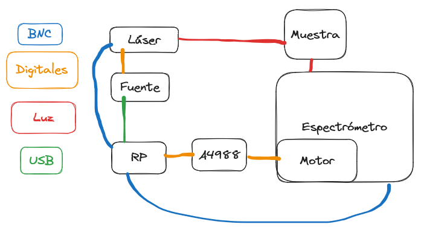
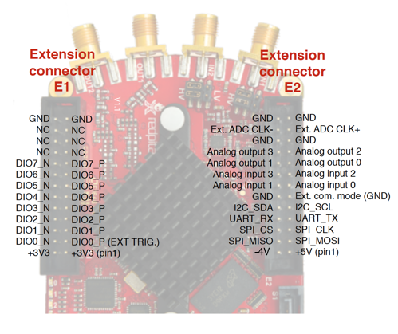
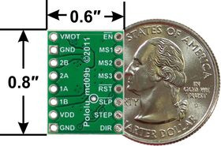

Primer día de tésis oficial. 

La idea de hoy es revisar el estado actual de la sección de instrumentación de la tésis, enumerar las cosas que quedan por hacer y anotarlas como objetivos en el cronograma y tratar de ponerles una fecha de fin. También determinar la fecha en la que vamos a necesitar usar los instrumentos del INQUIMAE para hacer la modificación. Una vez identificados empezar a trabajar para conseguir los objetivos que pueda hoy.



objetivos para hoy:
Los objetivos más inmediatos para instrumentación son:
1. chequear que funcione bien el motor por pasos con el controlador POLOLU. Sería hacer el paso 3.3 de instrumentación del cronograma.
1. Mover la carga de la calibración y manejo del espectrómetro a user_interface

Para probar el punto 1 (conectar a la RP y usar sólo el motor):
En la PC del labo desde WSL(usar con windows terminal que es mejor) activar el venv y abrir un intérprete de python y pegar el siguiente código:
obs: la ip de la red pitaya es 10.200.0.124 (al momento de escribir esto, puede cambiar). No se por qué no funciona el hostname "rp-f05512.local" desde python, pero si desde la terminal de WSL. 

```python
import rpyc
from ucnpexp.instruments import A4988, M061CS02
conn = rpyc.connect('10.200.0.124', port=18861)
ttls = {
        'notenable' :   conn.root.create_RPTTL('notenable', (False, 'n', 0)),
        'ms1'       :   conn.root.create_RPTTL('ms1', (False, 'n', 1)),
        'ms2'       :   conn.root.create_RPTTL('ms2', (False, 'n', 2)),
        'ms3'       :   conn.root.create_RPTTL('ms3', (False, 'n', 3)),
        'notreset'  :   conn.root.create_RPTTL('notreset', (True, 'n', 4)),
        'notsleep'  :   conn.root.create_RPTTL('notsleep', (True, 'n', 5)),
        'pin_step'  :   conn.root.create_RPTTL('pin_step', (False, 'n', 6)),
        'direction' :   conn.root.create_RPTTL('direction', (True, 'p', 7)),
        }
driver = A4988(ttls)
motor = M061CS02(driver)
```

Con ese código ya deben estar configurados los pines de la red pitaya.
Como para el pololu A4988 se usa el shield del arduino, da igual la configuración de algunos pines: ms1, ms2, ms3, notreset, notsleep, notenable.
Todos estos están directamente llevados a tierra o a 5v según corresponda por el shield.
Los únicos pines que importan son los de dirección y step que son los n6 y p7:



El cable blanco del lado del shield es el direction, el otro es el step.
Por otro lado, hay que conectar los 3.3V y GND lógicos. 
El cable amarillo del lado del shield es el GND y el otro es 3.3V.
Ya conecté todas las cosas. Ahora chequeo voltajes de los pines del [POLOLU](https://www.pololu.com/product/1182):



- VDD: 3.3
- notenable: 0
- ms1: 0
- ms2: 0
- ms3: 0
- notreset: 3.3
- notsleep: 3.3

Como todos los ms están en low la configuración debería ser de full step. 
Para el motor que tengo de prueba MKP42HT47-168MA eso debería ser 200 pasos.
El motor va conectado a 12V, El cable de red azul es 12V y el blanco GND (distinto al GND lógico).

Con todo esto conectado probé el motor:
Algo no funciona. 
Está incluso pero que antes.
No se si es el pololu o el motor, pero cuando le digo que de n pasos se nota que el motor hace algo pero el palito no gira. Queda probar para la próxima vez si es el motor o el pololu.
Me dijo hernán que podemos pedir pololu y motor en labo 5.
Cuando esté él en la facultad lo hago porque a mi sólo no me lo van a dar.

<hr>

Arranco a resolver el punto2:
Agrego todas las configuraciones a user interface.
Quizás quedan más cosas pero esto falta hacer seguro:
1. agregarle quits a las clases de UI aparte de la principal
1. agregar un método para guardar la calibración en un .yaml
1. ver si se pueden mejorar las clases de configuración que no son la principal. El usuario tiene mucha libertad, debería ser más lineal.

Besito ta la proxima