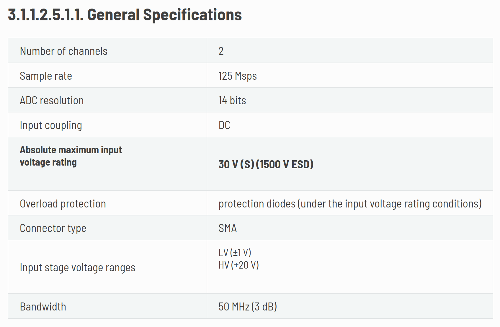

La idea de hoy es poder usar el módulo analógico de la red pitaya con el software de juan. 
Quizás hacer algún tipo de wrapper alrededor de su méotod de conteo de fotones y medir voltaje con eso.

Para medir voltajes se puede usar el objeto fpga.osc del módulo de la RP.
En [ésta](https://redpitaya.readthedocs.io/en/latest/developerGuide/hardware/125-14/fastIO.html#anain) página está todo explicado en cuanto al hardware.

Algunas cosas importantes:

1. Especificaciones generales: 
1. [Acá](https://forum.redpitaya.com/viewtopic.php?t=557) hablan de qué es la decimación y un método para tomar el promedio de los datos que no se miden cuando bajás la frecuencia por decimación.

La decimación cumple esta ecuación

$$\frac{MSR}{d} = SR = \frac{b}{t}$$

donde MSR es el maximum sampling rate de la RP: 125MHz, d es la decimación, SR el sampling rate real, b el buffer size 16384 y t el tiempo de medición de la señal.

En el link del segundo punto de arriba dicen que hay un modo en el cual "Additionally you can enable averaging which basically takes the average of the 'lost' samples if you are running a lower samplerate.", que se activa con

```bash
monitor 0x40100028 1
```

y se desactiva con 

```bash
monitor 0x40100028 0
```

Me gustaría probar si es realmente así que hace el promedio de los puntos que no mediste, porque si ese es el caso se podría poner una decimación muy grande y tomar solo los últimos dos puntos de los datos (la FPGA integraría automáticamente).
Para ver eso alimento a la RP con una senoidal de 10hz 0.5vpp.
Pongo la variable trigger_post que determina la cantidad de puntos que se guardan luego del trigger en 4 y una decimación igual al sampling rate, así haría una medición de 4 segundos y estaría promediando 10 ciclos de la senoidal, el promedio debería dar aprox 0. 
Si hago lo mismo pero con una decimación mucho menor el promedio no debería cambiar tanto punto a punto.
Bueno, me di cuenta que lo que quiero hacer no se puede hacer porque la máxima decimation que me permite poner es 2^17, que son 953 samples por segundo. 